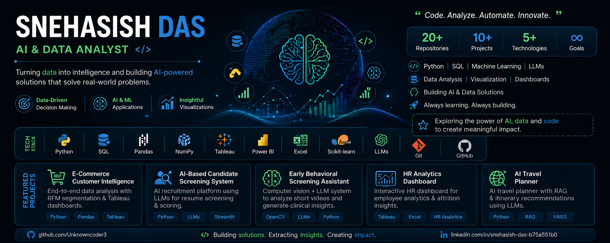

<h1 align="center">Hi 👋, I'm Snehasish Das</h1>
<h3 align="center">AI & Data Analyst | Applied AI Developer</h3>

  <b>Building real-world AI and data-driven systems that combine ML, LLMs, analytics, and clean user experiences.</b>

  
  

---

## 🚀 About Me

🎓 A **Computer Science & Business Systems (CSBS) Graduate**

💡 Passionate about **AI, Data Analytics, Business Intelligence, and Data-Driven Applications**

🧠 Love building **end-to-end, real-world systems** using **Machine Learning, LLMs, Data Analytics, and modern web tools**

📊 Experienced in working with **Python, SQL, Pandas, Tableau, Power BI, and Machine Learning**

📈 Constantly learning, shipping projects, and improving **problem-solving & system design skills**

I enjoy working on projects that sit at the intersection of **AI + data analytics + software engineering + business use cases**, with a strong focus on **practical deployment, meaningful insights, and clean architecture**.

---

## 🛠️ Tech Stack

### 💻 Core Strengths
* Python • Data Analytics • LLM-based Systems • Full-Stack Web Apps
* System Thinking • Clean Architecture • End-to-End Deployment

### 💻 Programming & Web
* JavaScript | HTML | CSS
* React | Vite | Tailwind CSS
* Streamlit | Flask

### 🤖 AI / ML
* Applied Machine Learning
* NLP & Embeddings
* LLM-based Systems (LangChain, Ollama)
* Vector Search (FAISS)
* Computer Vision

### 📊 Data & Analytics
* SQL & Data Analysis
* Pandas | NumPy
* Matplotlib
* Tableau
* Power BI (Dashboards & KPIs)
* Microsoft Excel

### 🧰 Tools
* Git & GitHub
* VS Code

---

## 📌 Featured Projects

🔹 **Early Behavioral Screening Assistant (AI + CV + LLM)**  
> Built a privacy-first behavioral observation system that analyzes short videos to extract early behavioral signals.  
> Combines computer vision with LLM-based reasoning to produce explainable, non-diagnostic screening insights for real-world use.  
🔗 Repository: https://github.com/Unknowncoder3/Early-behavioral-screening-AI  

🔹 **AI Resume Screening Engine**  
> Built a recruitment system that evaluates candidates using resumes, GitHub activity & academics via local LLMs.  
> Automates shortlisting and scoring, reducing human screening time by ~60%.  
🔗 Repository: https://github.com/Unknowncoder3/ai-recruitment-screening  

🔹 **Smart Travel Planner (LLM + RAG)**  
> Built an AI travel assistant that generates personalized itineraries in under 2s using LLMs + FAISS.  
> Reduced manual planning effort by ~70% in testing through automated place, route & budget reasoning.  
🔗 Repository: https://github.com/Unknowncoder3/AI-based-Travel-Planner  

🔹 **Autonomous Web Intelligence Bot**  
> Designed an intelligent scraper + Q&A engine using embeddings and local LLMs to extract and reason over web data.  
> Enables document-level querying across scraped content with zero manual filtering.  
🔗 Repository: https://github.com/Unknowncoder3/Ai-based-Web-scrapper  

🔹 **StudyBuddy**  
> End-to-end AI productivity platform combining multiple tools (notes, planner, AI helpers) with a modern UI.  
> Focused on clean architecture and real-world usability.  
🔗 Repository: https://github.com/Unknowncoder3/StudyBuddy  

➡️ *Check out my repositories below to explore full implementations, documentation, and demos.*

---

## 🎯 What I’m Looking For

I’m looking for opportunities where I can build and deploy **real-world AI and data-driven systems** —  
RAG applications, LLM tools, data analytics solutions, business intelligence dashboards, and intelligent software platforms — in fast-moving, product-focused teams.

Open to:
* Data Analyst / BI Analyst

* AI / ML Engineer

* Applied AI / Data & AI Engineer

* AI-focused Software Engineering roles

---

## 📈 GitHub Activity & Impact

  

  Consistent contributor • Project-driven learning • Real-world systems

---

## 🤝 Let's Connect

📌 **LinkedIn:** [https://www.linkedin.com/in/snehasish-das-b75a551b0/](https://www.linkedin.com/in/snehasish-das-b75a551b0/)

📌 **Instagram:** [https://www.instagram.com/a_ordinary__guy](https://www.instagram.com/a_ordinary__guy)

⭐ *If you find my work interesting or useful, feel free to star ⭐ the repositories — it really helps!*

---
